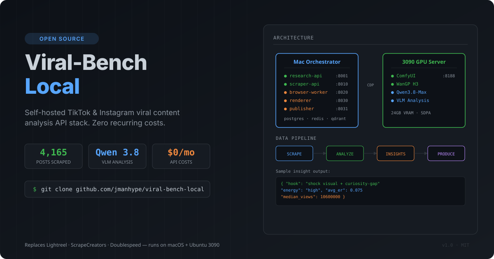

<p align="center">
  
</p>

## What it is

Drop-in API replacements for **Lightreel**, **ScrapeCreators**, and **Doublespeed** that run entirely on your own hardware. Scrape TikTok/Instagram posts, analyze them with Qwen3.8-Max VLM (88.7% VideoMMMU), extract structural patterns (hooks, pacing, energy, format), and feed insights directly into video production pipelines.

**Zero recurring API costs.** One `./start-all.sh` and you have a full content intelligence stack.

## Proof

| Metric | Value |
|--------|-------|
| Posts scraped | 4,165+ from top creators |
| VLM model | Qwen3.8-Max (VideoMMMU 88.7%) |
| Analysis speed | ~6/min concurrent |
| Top pattern found | Shock visual + curiosity-gap + high energy = 7.5% ER, 10.6M median views |
| Monthly API cost | $0 |

## Architecture

```
Mac Orchestrator                    3090 GPU Server
├── research-api    :8001           ├── ComfyUI       :8188
├── scraper-api     :8010           ├── WanGP H3      (multishot)
├── browser-worker  :8020           ├── Qwen3.8-Max   (VLM)
├── renderer        :8030           └── SDXL/FLUX     workflows
├── publisher       :8031
├── postgres        :5432
├── redis           :6379
└── qdrant          :6333
```

**Data pipeline:** `SCRAPE → ANALYZE → INSIGHTS → PRODUCE`

Each stage is an independent HTTP service. Swap any node for your own implementation.

## Services

| Service | Port | Replaces | Status |
|---------|------|----------|--------|
| research-api | 8001 | Lightreel `/v1/chat` | ✅ Live |
| scraper-api | 8010 | ScrapeCreators | ✅ Live |
| browser-worker | 8020 | ego-browser automation | ✅ Live |
| renderer | 8030 | Doublespeed rendering | 🔨 Building |
| publisher | 8031 | Multi-platform posting | 🔨 Building |
| mcp-server | 8020 | Model Context Protocol | 📋 Planned |

## Quick Start

```bash
git clone https://github.com/jmanhype/viral-bench-local.git
cd viral-bench-local

# Set up environment
uv venv && source .venv/bin/activate
uv pip install -e ".[dev]"

# Copy env template and add your ModelScope key
cp .env.example .env
# Edit .env → set MODELSCOPE_API_KEY

# Start all services
./start-all.sh

# Verify
curl http://localhost:8001/health
curl "http://localhost:8001/v1/insights?dimension=all&min_n=3"
```

## Key Endpoints

```bash
# Analyze a TikTok video with VLM
curl -X POST http://localhost:8001/v1/analyze \
  -H "Content-Type: application/json" \
  -d '{"post_url": "https://www.tiktok.com/@user/video/123"}'

# Get aggregated insights across corpus
curl "http://localhost:8001/v1/insights?dimension=all&min_n=3"

# Scrape all videos from a TikTok profile
curl -H "x-api-key: local-dev" \
  "http://localhost:8010/v3/tiktok/profile/videos?handle=charlidamelio"

# Bulk ingest + analyze
python -m services.research.bulk_ingest --min-posts 500
```

## Viral Pattern Insights (from corpus)

The analysis pipeline discovered these patterns separate top 10% from bottom 50%:

| Dimension | Top 10% | Bottom 50% |
|-----------|---------|------------|
| Energy | 63% high, 15% extreme | 43% medium, 36% high |
| Hook | Shock visual + curiosity-gap text overlay | Generic text overlay only |
| Best combo ER | 7.5% (shock + high energy) | 2.1% |
| Median views | 10.6M | 800K |
| Pacing | Rapid two-beat OR slow-burn→rapid | Uniform single take |

## Requirements

- **macOS** (orchestration host) or Linux
- **Ubuntu + RTX 3090** (GPU server, optional but recommended for H3/WanGP)
- **Python 3.11+** with [uv](https://github.com/astral-sh/uv)
- **ModelScope API key** (free tier works) — [get one here](https://modelscope.cn/my/myaccesstoken)
- **Docker** (for postgres, redis, qdrant)

## License

MIT
